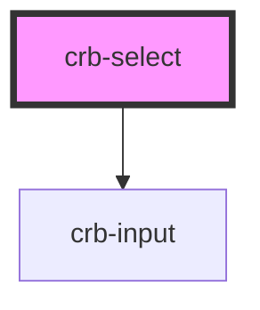

# crb-select

The properties section below is auto generated but I can type my own docs in here.

<!-- Auto Generated Below -->

## Properties

| Property               | Attribute | Description        | Type       | Default     |
| ---------------------- | --------- | ------------------ | ---------- | ----------- |
| `label`                | `label`   |                    | `string`   | `undefined` |
| `name`                 | `name`    |                    | `string`   | `undefined` |
| `options` _(required)_ | --        | Options to display | `Option[]` | `undefined` |

## Dependencies

### Depends on

- [crb-input](../crb-input)

### Graph

----------------------------------------------

*Built with [StencilJS](https://stenciljs.com/)*
